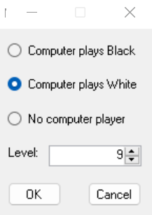
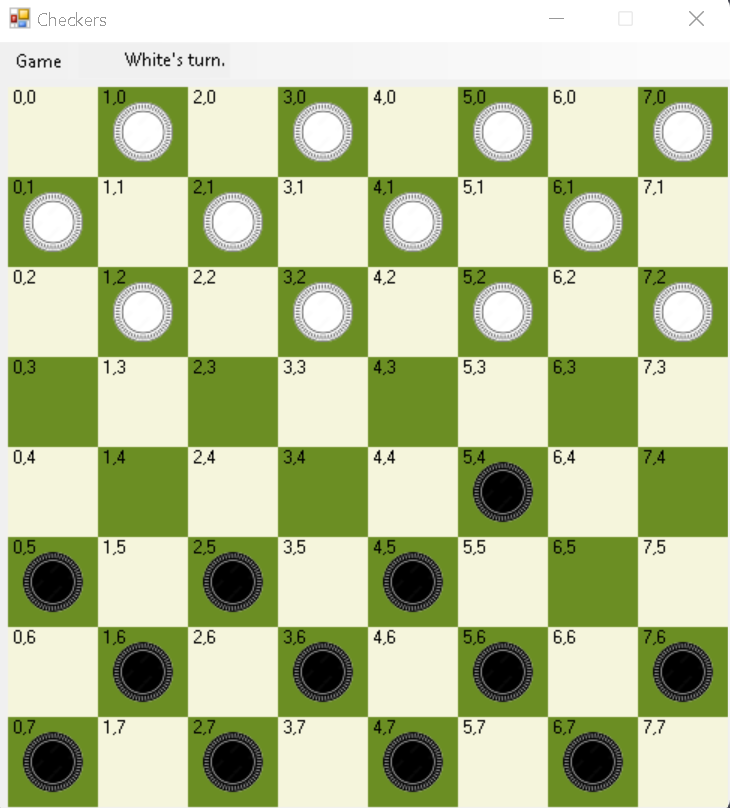

# Checkers-With-AI
**Authors:** Rodney Howell, Josh Weese, and Darius McAdam  
**Date:** Spring 2022  
**Purpose:** Project for Data and Program Stuctures (CIS 300)  
**Language:** C# 

## Description
This project is an implementation of Checkers that lets users play against an AI. The AI utilizes a game tree. It uses a negamax algorithm to determine the best move in the game tree. The program uses Alpha-beta pruning to reduce the number of nodes the negamax algorithm needs to evaluate in the tree. Players can play against the computer on difficulty levels ranging from 1 to 12. The level corresponds to the height of the game tree the AI uses to generate its next move.

This was my favorite data structures project. It was fun to code and debug. When the solution is ran the following window appears. This window lets players choose if they want to play against the AI or another human.

*Figure 1 - Settings selection at the start of a game*

After OK is clicked the game begins! The rules are the same as normal checkers. Pieces can only move to unoccupied spaces and checkers must skip if they have the opportunity. Checkers that reach the other side of the board are kinged The game proceeds until black or white are out the pieces. 

